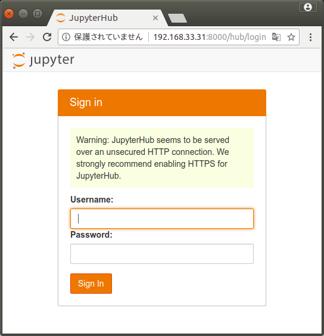

######################################################################
JupyterHub セットアップログ
######################################################################

このドキュメントでは、JupyterHubのセットアップ手順について記述してあります。

======================================================================
関連パッケージのインストール
======================================================================

----------------------------------------------------------------------
yum リポジトリにEPELを追加
----------------------------------------------------------------------

.. code-block:: bash

    $ yum install epel-release

----------------------------------------------------------------------
gitのインストール
----------------------------------------------------------------------

.. code-block:: bash

    $ yum install git

----------------------------------------------------------------------
gccのインストール
----------------------------------------------------------------------

.. code-block:: bash

    $ yum install gcc gcc-c++

----------------------------------------------------------------------
python3のインストール
----------------------------------------------------------------------

.. code-block:: bash

    $ yum install python34 python34-devel python34-pip
    $ yum install matplotlib
    $ yum install pandas

----------------------------------------------------------------------
NodeJSのインストール
----------------------------------------------------------------------

.. code-block:: bash

    $ yum install nodejs npm

----------------------------------------------------------------------
JupyterHubインストール
----------------------------------------------------------------------

.. code-block:: bash

    $ npm install -g configurable-http-proxy
    $ pip3 install jupyterhub
    $ pip3 install --upgrade notebook

----------------------------------------------------------------------
SudoSpawnerインストール
----------------------------------------------------------------------

.. code-block:: bash

    $ pip3 install git+https://github.com/jupyter/sudospawner

======================================================================
JupyterHubのセットアップ
======================================================================

----------------------------------------------------------------------
JupyterHubサービス起動用のユーザ追加
----------------------------------------------------------------------

JupyterHubサービスを起動するユーザとして jupyter ユーザを追加します。

.. code-block:: bash

    $ groupadd shadow
    $ useradd -s /sbin/nologin -M -g shadow jupyter
    $ chgrp shadow /etc/shadow
    $ chmod g+r /etc/shadow

----------------------------------------------------------------------
JupyterHubサービス利用者用のグループ追加
----------------------------------------------------------------------

.. code-block:: bash

    $ groupadd jupyterhub

----------------------------------------------------------------------
JupyterHubサービスを利用するユーザをグループに追加
----------------------------------------------------------------------

ここでは hoge ユーザを jupyterhub グループに追加する場合を例に記述します。

.. code-block:: bash

    $ gpasswd -a hoge jupyterhub

----------------------------------------------------------------------
SudoSpawnerの設定
----------------------------------------------------------------------

| /etc/sudoersファイルに次の設定を追加します。
| なお、このファイルの編集にはvisudoコマンドを使用します。

.. code-block:: text

    Cmnd_Alias JUPYTER_CMD = /usr/bin/sudospawner
    jupyter ALL=(%jupyterhub) NOPASSWD:JUPYTER_CMD
    Defaults:jupyter !requiretty

----------------------------------------------------------------------
JupyterHub設定ファイルの追加
----------------------------------------------------------------------

JupyterHub設定ファイル用のフォルダを作成します。

.. code-block:: bash

    $ mkdir /etc/jupyterhub
    $ chown jupyter /etc/jupyterhub

| JupyterHub設定ファイルを追加します。
| 次のコマンドを実行すると設定ファイルの雛形が作成されます。

.. code-block:: bash

    $ cd /etc/jupyterhub
    $ sudo -u jupyter jupyterhub --generate-config

作成された設定ファイルの次の設定を変更します。

.. code-block:: text

    c.JupyterHub.confirm_no_ssl = True
    c.JupyterHub.ip = '0.0.0.0'
    c.JupyterHub.spawner_class = 'sudospawner.SudoSpawner'
    c.Spawner.disable_user_config = True
    c.Spawner.notebook_dir = '~/notebooks'
    c.Authenticator.admin_users = { 'vagrant' }
    c.LocalAuthenticator.group_whitelist = { 'jupyterhub' }

----------------------------------------------------------------------
JupyterHub用 Systemd Unit ファイルの追加
----------------------------------------------------------------------

| JupyterHubサービスを Systemd から起動／終了するための Systemd Unit ファイルを作成します。
| /lib/systemd/system/jupyterhub.service ファイルを新規に作成し、次の設定をします。

.. code-block:: text

    [Unit]
    Description = JupyterHub
    After = network.target

    [Service]
    User = jupyter
    ExecStart = /bin/jupyterhub
    WorkingDirectory = /etc/jupyterhub

    [Install]
    WantedBy = multi-user.target

----------------------------------------------------------------------
JupyterHubサービスの自動起動の設定
----------------------------------------------------------------------

.. code-block:: bash

    $ systemctl daemon-reload
    $ systemctl enable jupyterhub

----------------------------------------------------------------------
JupyterHubサービスが使用するポートをファイアウォールで許可
----------------------------------------------------------------------

.. code-block:: bash

    $ firewall-cmd --add-port=8000/tcp --permanent

----------------------------------------------------------------------
JupyterHubサービスを使用するユーザの設定
----------------------------------------------------------------------

| ホームディレクトリに Jupyter Notebook 用のディレクトリ（notebooks）を作成します。
| ここでは hoge ユーザの場合を例に記述します。
| この作業は各ユーザが個々に行います。

.. code-block:: bash

    $ cd ~hoge
    $ mkdir notebooks

今後、JupyterHub上で作成するファイルは、すべてこのディレクトリ下に保存されます。

----------------------------------------------------------------------
JupyterHubサービス起動の動作確認
----------------------------------------------------------------------

| OSを再起動後、ブラウザからJupyterHubにアクセスし、次のようにログイン画面が表示されれば正常に動作しています。
| 以下の例では、サーバのIPアドレスを192.168.33.31、ポート番号を8000としてあります。

